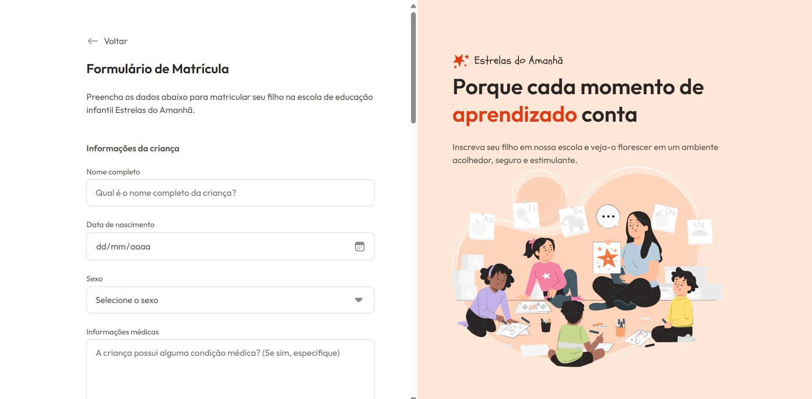

# Formulario-matricula-Rocketseat

Um formulário de uma escola para crianças. Projeto desenvolvido com **HTML** e **CSS**, como parte de um desafio proposto pela **Rocketseat**, focando na construção de formulários e usando suas tags HTML de forma semântica.

## 🧾 Sobre o projeto

O projeto tem como objetivo praticar a estruturação de um formulário HTML semântico, sendo estilizado através do CSS.  

## 🛠 Tecnologias utilizadas

- HTML5  
- CSS3

## ✍️ Autor

Desenvolvido por [**@lagantunes**](https://github.com/lagantunes)
